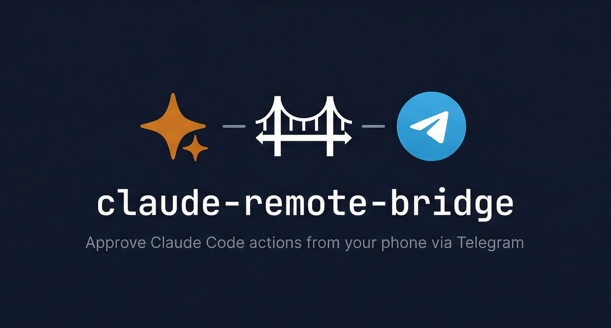
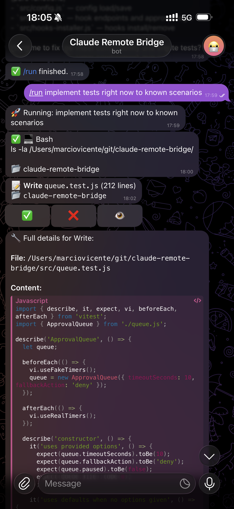

<p align="left">
  
</p>

# Claude Remote Bridge

Control Claude Code remotely from Telegram with smart approval rules. Approve or deny tool usage with inline buttons, auto-approve safe tools, auto-deny dangerous commands, and send instructions directly from your phone.

## How It Works

```
Claude Code --HTTP hooks--> Bridge Server (localhost:3456) --Bot API--> Telegram <--> Your Phone
```

Remote Bridge runs as a local HTTP server that integrates with Claude Code via **hooks** (configured in `~/.claude/settings.json`). Before Claude executes risky tools (Bash, Edit, Write, NotebookEdit), the hook sends the request to the bridge server, which applies smart approval rules or forwards it to your Telegram bot with Approve/Deny buttons. The Telegram bot uses long polling (outbound only, no tunnel needed).

**Smart approval rules:**
- Read-only tools (Read, Glob, Grep) are auto-approved without bothering you
- Dangerous commands are auto-denied based on configurable patterns
- Temporary bulk approval mode (`/approveall`) for when you trust the flow

## Quick Start

### Prerequisites

- [Claude Code](https://docs.anthropic.com/en/docs/claude-code)
- [Node.js](https://nodejs.org) 18+ or [Bun](https://bun.sh)
- A Telegram account (free)

### Install

```bash
git clone https://github.com/marciovicente/claude-remote-bridge.git
cd claude-remote-bridge
npm install && npm link
# or: bun install && bun link
```

### Setup and Start

```bash
# Interactive setup — creates a Telegram bot and installs Claude Code hooks
claude-remote-bridge setup

# Start the bridge server
claude-remote-bridge start
```

That's it. The `setup` command walks you through creating a Telegram bot via [@BotFather](https://t.me/BotFather), saves the token, and installs the necessary hooks in Claude Code. The `start` command launches the bridge server — from that point, any Claude Code session on your machine will route approval requests through Telegram.

### CLI Commands

```bash
claude-remote-bridge setup            # Interactive setup (create bot, install hooks)
claude-remote-bridge start            # Start the bridge server
claude-remote-bridge start -d         # Start in background (detached mode)
claude-remote-bridge stop             # Stop the background bridge server
claude-remote-bridge status           # Show bridge status and configuration
claude-remote-bridge test             # Send a test message to Telegram
claude-remote-bridge hooks-install    # Install Claude Code hooks (without full setup)
claude-remote-bridge hooks-uninstall  # Remove Claude Code hooks
```

## Telegram Commands

| Command | Description |
|---------|-------------|
| Send any message | Forward as instruction to Claude (via `/run`) |
| `/run <instruction>` | Start a new Claude session with the given instruction |
| `/approveall [min]` | Auto-approve all requests for N minutes (default: 30) |
| `/stopapprove` | Disable auto-approve mode |
| `/pause` | Toggle pause — permissions fall back to terminal |
| `/cancel` | Cancel the current `/run` session |
| `/stop` | Stop the running Claude process |
| `/status` | Show bridge status (pending requests, auto-approve, etc.) |
| `/help` | Show available commands |

### Approval Buttons

When Claude tries to use a tool that requires approval, you receive a message with:

- **✅** — approve the tool call
- **❌** — deny the tool call
- **👁** — view full tool input details

<p align="center">
  
</p>

## Smart Approval Rules

### Auto-Approve (safe tools)

These tools are approved automatically without a Telegram notification:

- `Read`, `Glob`, `Grep` — file reading
- `WebSearch`, `WebFetch` — web access
- `TodoWrite` — task management

### Auto-Deny (dangerous patterns)

Tool inputs matching these patterns are blocked automatically:

- `rm -rf /`
- `git push --force origin main`
- `git push --force origin master`

### Customization

Edit `~/.claude-remote-bridge/config.json`:

```json
{
  "approval": {
    "timeoutSeconds": 300,
    "autoApproveTools": ["Read", "Glob", "Grep", "WebSearch", "WebFetch", "TodoWrite"],
    "alwaysDenyPatterns": ["rm -rf /", "git push --force origin main", "git push --force origin master"]
  }
}
```

## Architecture

Remote Bridge is a local Express server that integrates with Claude Code via HTTP hooks:

- **PreToolUse hook**: Intercepts risky tool calls (Bash, Edit, Write, NotebookEdit) and routes them through smart approval rules or Telegram
- **Notification hook**: Forwards Claude notifications to Telegram (async)
- **Stop hook**: Notifies Telegram when a Claude session finishes (async)

The hooks are installed in `~/.claude/settings.json` and point to `http://127.0.0.1:3456`. The HTTP connection is held open until the user responds via Telegram buttons (up to 300s timeout).

## Security

- The Telegram bot only responds to the configured chat ID
- Bot token and config are stored locally in `~/.claude-remote-bridge/config.json`
- All communication is outbound (long polling) — nothing is exposed to the network
- The bridge server only listens on `127.0.0.1` (localhost)

## Troubleshooting

**Bot doesn't respond to messages:**
- Make sure the bridge server is running (`claude-remote-bridge status`)
- The bot only works while the bridge server is active

**Permission prompts not appearing:**
- Check hooks are installed (`claude-remote-bridge status`)
- Check the bridge isn't paused (`/status` in Telegram)

**Auto-approve not working:**
- Verify the tool name matches exactly (case-sensitive)
- Check `~/.claude-remote-bridge/config.json`

## License

[MIT](LICENSE)
